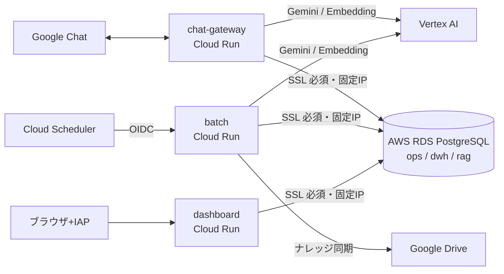

# AKEBONO AI Manager

**AIマネージャーは「判断する上司」ではなく、文脈を供給し、思考を促し、記録する装置です。**
評価と最終判断は、いつも人間に残します。

社内メンバーの業務把握・整理・次アクション示唆を担う Google Chat ボット+可視化ダッシュボード。
いつものチャットに返事をするだけで、日報が自動で完成し、業務知識が即座に手に入り、
「予想 → 実行 → 振り返り」の思考サイクルが無理なく回り始めます。

- 📘 要件・基本設計: [docs/refference/ai-manager-requirements-design.md](docs/refference/ai-manager-requirements-design.md)(v0.2)+ [v0.3 追補(マスタ管理とナレッジスコープ)](docs/refference/ai-manager-requirements-v0.3-addendum.md)
- 📗 導入前後の変化(非エンジニア向け): [docs/refference/ai-manager-before-after-guide.md](docs/refference/ai-manager-before-after-guide.md)
- 📙 Phase 1 実装設計・ADR: [docs/architecture/phase1-implementation.md](docs/architecture/phase1-implementation.md)
- 🚀 デプロイ設定手順: [docs/operations/deployment-setup.md](docs/operations/deployment-setup.md)

## できること(Phase 1)

| 機能 | 内容 |
|---|---|
| 朝の問いかけ(M2) | 平日朝、タスク状況を踏まえた3つの問いを DM で配信。答えるうちに仮説が言語化される |
| 夕の振り返り(M2) | 完了報告を検知して「予想との差分」「次に変えること」を一緒に整理 |
| 随時の質問対応(M1/M2) | 業務知識・専門用語を RAG(ナレッジベース)から即答。例え話ライブラリで腹落ちする説明 |
| 日報・週報の自動生成(M4) | 対話ログから日報を自動生成、本人は確認ボタンを押すだけ。管理者には週次サマリ |
| エスカレーション(M6) | AI が確信を持てない事項を管理者へ自動ルーティング |
| 可視化ダッシュボード(M5) | プロジェクト横断の進捗、タスク負荷、個人の振り返り資産、成長観察(管理者限定)、AI コスト |

## アーキテクチャ

GCP(Cloud Run + Vertex AI Gemini)⇔ AWS(既存 RDS PostgreSQL に `ai_manager` DB を追加)のクロスクラウド構成。
運用データ(ops)/ 分析スタースキーマ(dwh)/ ベクトル検索(rag)を PostgreSQL 1本に統合しています。



## リポジトリ構成

```
packages/
├── shared/        # 設定・DB接続・LLMクライアント・プロンプト(SoT)・エラーコード(SoT)
├── db/            # マイグレーション(ops/rag/dwh)+夜間ETL(pg_cron)
├── chat-gateway/  # Chat イベント処理(対話エンジン・カード操作)
├── batch/         # 定時ジョブ(朝の問いかけ/日報/週報/ナレッジ同期)
└── dashboard/     # 可視化 Web アプリ(レスポンシブ・IAP 認証)
scripts/setup/     # セットアップスクリプト(PowerShell)+SQL テンプレート
docs/              # 要件・実装設計・運用手順・エラーコード
.github/workflows/ # CI(ci.yml)/ 自動デプロイ(deploy.yml)
```

## 開発

```bash
npm ci          # 依存関係のインストール(Node.js 22+)
npm run build   # 型チェック+ビルド
npm test        # ユニットテスト
```

デプロイは main ブランチへの push で自動実行されます(GitHub Actions)。
初回セットアップ(GCP/AWS/GitHub secrets)は [docs/operations/deployment-setup.md](docs/operations/deployment-setup.md) の
PowerShell スクリプトで完結します。エラーコードの逆引きは [docs/operations/error-codes.md](docs/operations/error-codes.md)。

## 開発方法論

このリポジトリは AI ネイティブ開発方法論(8つの専門 AI ロール+9フェーズ+2層ゲート)で運用されています。

| 知りたいこと | 参照先 |
|---|---|
| 方法論の全体構成 | [`.ai-native/methodology/INDEX.md`](.ai-native/methodology/INDEX.md) |
| 最上位原則と構造原則 | [`.ai-native/methodology/common/core-principles.md`](.ai-native/methodology/common/core-principles.md) |
| フェーズ定義・ゲート条件 | [`.ai-native/methodology/common/phase-definitions.md`](.ai-native/methodology/common/phase-definitions.md) |
| レビュー基準 | [`.ai-native/methodology/common/review-standards.md`](.ai-native/methodology/common/review-standards.md) |
| ロール定義(8ロール) | [`.ai-native/methodology/roles/`](.ai-native/methodology/roles/) |
| Claude Code 固有の実装ルール | [CLAUDE.md](CLAUDE.md) |
| フェーズ成果物 | `.ai-native/outputs/` |

## ライセンス

Apache License 2.0 - 詳細は [LICENSE](LICENSE) ファイルを参照してください。
