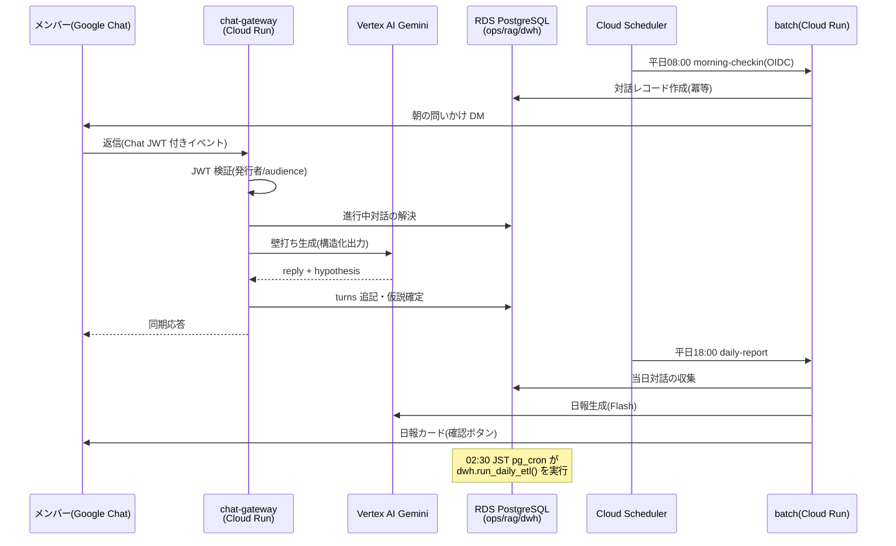

# Phase 1 実装設計

- 上位ドキュメント: [docs/refference/ai-manager-requirements-design.md](../refference/ai-manager-requirements-design.md)(要件・基本設計の SoT)
- 本書: Phase 1 実装のスコープ決定・アーキテクチャ・設計判断(ADR)を記録する

## 1. 実装スコープ

要件の段階導入計画(§10)に基づき Phase 1(M2 対話+M4 日報)を中核に、
デプロイ自動化の要請から可視化(M5)の Web ダッシュボードを前倒しで実装した。

| モジュール | 状態 | 実装 |
|---|---|---|
| M1 ナレッジベース | 部分実装 | Drive→チャンク→embedding→rag 同期(knowledge-sync)、RAG 検索。Chat からのナレッジ投入フローは Phase 2 |
| M2 デイリー対話エンジン | **実装済み** | 朝の問いかけ配信、仮説形成の壁打ち(構造化出力で hypothesis 抽出)、夕の振り返り(review 抽出)、随時 QA(RAG+例え話 few-shot) |
| M3 タスクオーケストレーション | 未実装(Phase 2) | ops.tasks スキーマと状態遷移ログのみ先行整備(ops の履歴設計は初日から正しく、の方針) |
| M4 自動レポーティング | **実装済み** | 日報自動生成+確認ボタン、週次管理者サマリ |
| M5 可視化ダッシュボード | **実装済み(前倒し)** | 自前 Web アプリ(下記 ADR-2)。dwh スキーマ+pg_cron ETL も併せて実装 |
| M6 エスカレーションルーター | 部分実装 | QA の確信度低下時の自動起票+管理者通知。回答品質の異常検知は Phase 2 |

## 2. リポジトリ構成

```
packages/
├── shared/        # 型・設定・DB接続・HTTP・Vertex AI/Chat APIクライアント・プロンプト(SoT)・エラーコード(SoT)
├── db/            # マイグレーション(ops/rag/dwh)、ETL関数、ランナー(冪等)
├── chat-gateway/  # Google Chat アプリ(Cloud Run)。イベント検証・対話状態機械・カードアクション
├── batch/         # 定時ジョブ(Cloud Run + Cloud Scheduler)。朝の問いかけ/日報/週報/ナレッジ同期
└── dashboard/     # M5 可視化(Cloud Run)。サーバーサイドレンダリング+単一デザインシステム
scripts/setup/     # PowerShell セットアップスクリプト+SQL テンプレート
.github/workflows/ # ci.yml(PR検証)/ deploy.yml(自動デプロイ)
```

要件 §8 の構成から `packages/agent`(Agent Engine)を Phase 1 では見送った(ADR-3)。

## 3. ランタイムアーキテクチャ



- **モデルルーティング(要件 6.5)**: ルールベース分類(`shared/routing.ts`)で
  定型=flash-lite / 知識回答=flash / 思考支援=pro に振り分け。概算コストを対話ごとに記録し `v_ai_cost` で監視
- **禁止事項の担保(要件 3.3)**: システムプロンプト(`shared/prompts.ts`)で禁止 4 項目を明示。
  加えて構造的に、AI からの顧客送信経路・タスク優先順位の書込経路を実装していない(実装レベルの担保)
- **クロスクラウド接続(要件 6.3)**: VPC コネクタ+Cloud NAT の固定エグレス IP、RDS CA バンドル同梱による SSL 必須、
  接続情報は Secret Manager。アプリ側プールは最大 2 接続/インスタンスに制限

## 4. セキュリティ境界

| 経路 | 保護 |
|---|---|
| Google Chat → chat-gateway | Chat 発行 JWT の署名・発行者・audience(プロジェクト番号)検証 |
| Cloud Scheduler → batch | Cloud Run IAM(--no-allow-unauthenticated)+アプリ層 OIDC 検証(発行者・audience・呼び出し元 SA)の多層防御 |
| ブラウザ → dashboard | ingress を LB(IAP)経由のみに制限+IAP JWT の署名検証(AUTH_MODE=iap)の多層防御。ロール(admin/member)は ops.users で解決し、管理者限定ページを分離 |
| GitHub Actions → GCP | Workload Identity Federation(キーレス)。attribute-condition で対象リポジトリに限定 |
| アプリ → RDS | SSL 必須+CA 検証、DB ユーザー分離(app_rw / dashboard_ro / 管理)、dashboard_ro は生の対話ログ参照不可 |

## 5. 設計判断の記録(ADR)

### ADR-1: マイグレーション方式は自前の軽量ランナー

- **決定**: Flyway / Prisma 等を導入せず、SQL ファイル+軽量ランナー(`packages/db/src/migrate.ts`)を実装
- **理由**: 要件の DDL が SQL で確定しており、pgvector / パーティション / plpgsql 関数など生 SQL が必須。
  versioned(一度だけ)+repeatable(毎回適用・冪等。ビュー/ETL関数/GRANT/pg_cron 登録)の意味論を 200 行弱で実現でき、依存を増やさない。
  repeatable を毎回適用にすることで「後から DB ロールを作成」「後から pg_cron を有効化」した場合も db-migrate ジョブ再実行だけで反映される(手動回復パス不要)
- **トレードオフ**: ロールバック機能なし(前方修正のみ)。小規模チームでは許容

### ADR-2: M5 ダッシュボードは Looker Studio ではなく自前 Web アプリ

- **決定**: BI ツール接続(要件 §6.4 では Phase 3 で確定予定の未決事項)に代えて、自前のサーバーサイドレンダリング Web アプリを実装
- **理由**: (1) ページデザインの統一・レスポンシブ要求に対し BI ツールでは制御が弱い
  (2) 管理者限定ビューを DB ロール+アプリ層ロールの二重制御で実装できる
  (3) Looker Studio の PostgreSQL コネクタは固定 IP 許可等の検証事項が多く Phase 1 の不確実性になる
- **トレードオフ**: グラフ表現力は BI ツールに劣る。分析の自由度が必要になった時点で bi_ro ロールを追加し Looker Studio 併用に戻せる(dwh ビューはそのまま使える)

### ADR-3: Agent Engine(packages/agent)は Phase 1 で見送り

- **決定**: Phase 1 は chat-gateway から Vertex AI を直接呼ぶ(要件 §10 Phase 1 構成「Chatボット + Gemini Flash」に忠実)
- **理由**: Phase 1 のフロー(朝夕の定型対話+RAG QA)は確定的で、プランニング/ツール呼び出しを要しない。
  定型は Functions 相当、判断はエージェント、という要件 §6.4 の方針どおり、M3/M6 の高度化(Phase 2)で Agent Engine を導入する
- **影響**: プロンプトの SoT は `shared/prompts.ts` に置き、エージェント導入時もここから供給する

### ADR-4: GitHub Actions → GCP はサービスアカウントキーではなく WIF

- **決定**: Workload Identity Federation によるキーレス認証
- **理由**: 長命キーの漏洩リスク排除(要件 11 秘匿情報)。セットアップは bootstrap-gcp.ps1 で自動化済みのため運用負荷は増えない

### ADR-5: tenant_id カラムは Phase 1 では追加しない

- **決定**: 要件 11 の「tenant_id をスキーマに予約」は、カラム追加ではなく「マイグレーションで追加可能な設計を保つ」ことで満たす
- **理由**: 要件 §7 の DDL(SoT)に tenant_id は含まれず、5 ユーザー運用に不要な複雑さを持ち込まない。
  SaaS 転用時に `ALTER TABLE ... ADD COLUMN tenant_id TEXT NOT NULL DEFAULT 'default'` + RLS を versioned マイグレーションで適用する

### ADR-6: Phase 1 の IaC は Terraform ではなく冪等な gcloud スクリプト

- **決定**: 要件 §8 の `infra/`(Terraform)は Phase 1 では作らず、`scripts/setup/bootstrap-gcp.ps1`(冪等な gcloud ラッパー)で GCP リソースを管理する
- **理由**: セットアップ対象が少なく(SA / WIF / Artifact Registry / API 有効化)、オペレーターの実行環境が PowerShell 前提のため、Terraform の導入・状態管理コストが見合わない。Cloud Run・Scheduler は deploy.yml が宣言的に上書きするため実質的な構成ドリフトは起きない
- **再検討条件**: マルチテナント化(SaaS 転用)で環境複製が必要になった時点で Terraform 化する(要件 §11 の IaC 方針を引き継ぐ)

## 6. 未決事項(要件 §13)への Phase 1 時点の回答

| 項目 | 状態 |
|---|---|
| PostgreSQL バージョン確認 | **運用前提**: pgvector 15.2+ / pg_cron。マイグレーションは pg_cron 不可でも成功する設計 |
| クロスクラウド接続方式 | 固定エグレス IP+SG 許可を採用(deployment-setup.md Step 3)。VPN は不採用 |
| マイグレーションツール | ADR-1 のとおり自前ランナー |
| Embedding モデル・次元 | gemini-embedding-001 / 768 次元(正規化あり)。環境変数で変更可、変更時は rag スキーマの vector 型変更が必要 |
| agent フレームワーク | ADR-3 のとおり Phase 2 で判断 |
| Chat カード UI | 日報確認・提案採否の 2 種を実装 |
| BI ツール | ADR-2 のとおり自前ダッシュボード |
