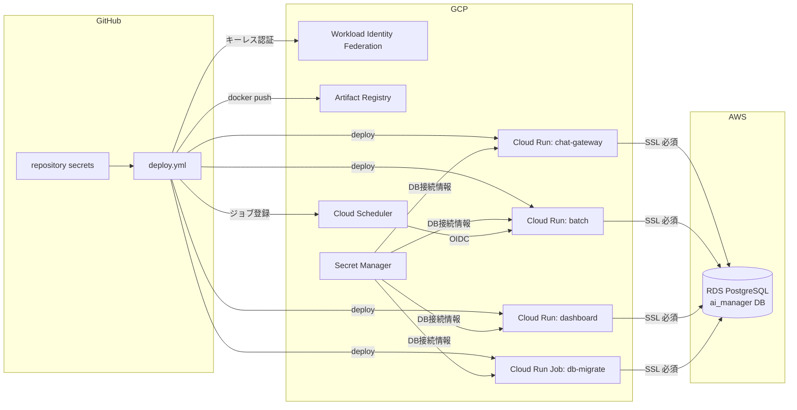

# デプロイ設定手順

- 対象: AI マネージャー Phase 1(chat-gateway / batch / dashboard / db-migrate)
- デプロイ方式: GitHub Actions(`.github/workflows/deploy.yml`)による自動デプロイ
- 設定値の管理: デプロイ設定は **GitHub repository secrets**、ランタイム秘匿情報(DB 接続情報)は **GCP Secret Manager**(要件 6.3)

## 全体像



一度セットアップすれば、以後は **main ブランチへの push だけでデプロイが完了**します
(ビルド → テスト → イメージ push → DB マイグレーション → 3 サービスのデプロイ → Scheduler 登録)。

## 命名ポリシー(既存アプリと同居する共有プロジェクト向け)

本アプリは既存の Firebase/GCP プロジェクトに他アプリと同居する前提のため、
作成するリソースはすべて固有プレフィックスで名前空間を分離している。

| 領域 | プレフィックス | 対象 |
|---|---|---|
| GCP リソース | `ai-manager-` | Cloud Run サービス/Job、Scheduler、Artifact Registry、SA、WIF プール/プロバイダ、VPC コネクタ/サブネット/ルーター/NAT/静的IP、Secret Manager(`ai-manager-db-*`) |
| PostgreSQL ロール | `ai_manager_` | `ai_manager_app_rw` / `ai_manager_dashboard_ro`(ロールは RDS インスタンス全体で共有されるため) |
| pg_cron ジョブ | `ai-manager-` | `ai-manager-daily-etl` / `ai-manager-ensure-partitions` |

同居にあたっての注意:

- **Firestore / Firebase Hosting / Firebase Auth は本アプリでは使用しない**(既存 Firebase アプリと競合しない)
- **pg_cron はインスタンスにつき1データベース**(`cron.database_name`)にしか入れられない。
  既に別 DB が pg_cron を使用している場合は `cron.database_name` を変更せず、
  手動フォールバック(後述)の `cron.schedule_in_database` 方式で登録する
- VPC コネクタ用サブネットの IP レンジは **VPC 内で未使用のレンジ**を選ぶこと
  (既存のサブネットは `gcloud compute networks subnets list --network default` で確認)

## 前提条件

| ツール | 用途 | 備考 |
|---|---|---|
| PowerShell 7+ (`pwsh`) | セットアップスクリプトの実行 | Windows PowerShell 5.1 でも可 |
| gcloud CLI | GCP リソースの作成 | オーナー相当の権限で `gcloud auth login` 済み |
| gh CLI | repository secrets の登録 | `gh auth login` 済み。**2.5.0 以上**(登録スクリプトが stdin 渡しの改行自動除去に依存) |
| psql | DB ロール作成・ユーザー登録 | RDS へ接続できるネットワークから実行 |

## セットアップ手順

### Step 1: AWS RDS 側の準備

既存 RDS インスタンスに対して以下を実施する(既存業務 DB とは database レベルで分離。要件 7.1)。

1. **データベース作成**(マスターユーザーで):

   ```sql
   CREATE DATABASE ai_manager;
   ```

2. **DB ロール作成**(ai_manager_app_rw / ai_manager_dashboard_ro。要件 7.5 の DB ユーザー分離):

   ```powershell
   psql "host=<RDS_HOST> dbname=ai_manager user=<マスターユーザー> sslmode=require" `
     -v app_rw_password='<強いパスワード>' `
     -v dashboard_ro_password='<強いパスワード>' `
     -f scripts/setup/create-db-roles.sql
   ```

   権限の付与(GRANT)はマイグレーションが冪等に行うため、ロール作成のみで良い。

3. **SSL の強制**(推奨): パラメータグループで `rds.force_ssl = 1`

4. **pg_cron の有効化**(夜間 ETL 用): パラメータグループの `shared_preload_libraries` に `pg_cron` を追加し、
   `cron.database_name = ai_manager` を設定して再起動。
   ※ **他の DB が既に pg_cron を使用している場合は `cron.database_name` を変更しないこと**
   (インスタンスにつき1データベースのため)。その場合は後述のフォールバックの
   `cron.schedule_in_database` 方式で登録する。
   ※ 有効化できない場合もマイグレーションは通知だけ出して成功する(後述のフォールバック参照)

5. **セキュリティグループ**: Step 3 で採番する GCP の固定エグレス IP からの 5432/tcp を許可

### Step 2: GCP リソースの一括作成(スクリプト)

```powershell
cd scripts/setup
./bootstrap-gcp.ps1 -ProjectId <GCPプロジェクトID> -GithubRepo TSUNAGUBA/akebono-ai-manager
```

> `-GithubRepo` は **GitHub 上の正式な大文字小文字**で指定すること(WIF の attribute-condition が
> OIDC トークンの repository クレームと大文字小文字を区別して照合するため)。

このスクリプトは冪等(再実行安全)で、以下を作成する:

- 必要 API の有効化(Cloud Run / Artifact Registry / Secret Manager / Vertex AI / Scheduler / Chat / Drive 等)
- Artifact Registry リポジトリ `ai-manager`
- デプロイ用 SA `ai-manager-deployer`(GitHub Actions が使用)/ ランタイム用 SA `ai-manager-runtime`(Cloud Run が使用)
- Workload Identity Federation `ai-manager-github-pool` / `ai-manager-github-provider`
  (**サービスアカウントキーを発行しないキーレス認証**。対象リポジトリからのトークンのみ許可)
- 最小権限の IAM バインディング

完了時に、repository secrets 用の設定ファイル `deploy-config.json` が出力される。

### Step 3: クロスクラウド接続(固定エグレス IP)

Cloud Run から RDS への接続経路に固定 IP を持たせる(要件 6.3)。

NAT は本アプリ専用のサブネットにのみ適用し、**同居する他アプリの外部通信経路には影響を与えない**構成とする。

```powershell
# 本アプリ専用のサブネット(初回のみ。--range は VPC 内で未使用の /28 を指定)
gcloud compute networks subnets create ai-manager-connector-subnet `
  --network default --region asia-northeast1 --range 10.8.0.0/28

# サーバーレス VPC アクセスコネクタ(初回のみ)
gcloud compute networks vpc-access connectors create ai-manager-connector `
  --region asia-northeast1 --subnet ai-manager-connector-subnet

# Cloud NAT + 静的 IP(初回のみ。NAT の適用範囲は専用サブネットに限定)
gcloud compute addresses create ai-manager-egress-ip --region asia-northeast1
gcloud compute routers create ai-manager-router --network default --region asia-northeast1
gcloud compute routers nats create ai-manager-nat `
  --router ai-manager-router --region asia-northeast1 `
  --nat-external-ip-pool ai-manager-egress-ip `
  --nat-custom-subnet-ip-ranges ai-manager-connector-subnet

# 採番された IP を確認し、RDS のセキュリティグループで許可する
gcloud compute addresses describe ai-manager-egress-ip --region asia-northeast1 --format 'value(address)'
```

> 既に同じ VPC に他アプリの Cloud Router / NAT が存在していても、ルーターを分け NAT の対象を
> 専用サブネットに限定しているため共存できる。

作成後、`deploy-config.json` の `GCP_VPC_CONNECTOR` に `ai-manager-connector` を設定する。

> 未設定の場合、Cloud Run はデフォルト経路(動的 IP)で外部接続する。検証目的で RDS を一時的に広く開ける場合のみ省略可。本番は必須。

### Step 4: ランタイム秘匿情報の登録(GCP Secret Manager)

```powershell
./register-gcp-runtime-secrets.ps1 -ProjectId <GCPプロジェクトID>
```

プロンプトに従って RDS エンドポイントと各 DB ユーザーのパスワードを入力する。
**再実行時は、変更しないパスワードは空 Enter でスキップできる**(既存の値を維持。シークレット未作成の新規分は必須)。
登録されるシークレット:

| シークレット名 | 内容 | 使用サービス |
|---|---|---|
| `ai-manager-db-host` | RDS エンドポイント | 全サービス |
| `ai-manager-db-name` | DB 名(既定 ai_manager) | 全サービス |
| `ai-manager-db-app-user` / `-password` | ai_manager_app_rw | chat-gateway / batch |
| `ai-manager-db-dashboard-user` / `-password` | ai_manager_dashboard_ro | dashboard |
| `ai-manager-db-admin-user` / `-password` | マイグレーション用管理ユーザー | db-migrate ジョブ |
| `ai-manager-db-master-admin-user` / `-password` | ai_manager_admin_rw(マスタ管理 UI 用) | dashboard(`DASHBOARD_ADMIN_DB_ENABLED=true` 時のみ) |

### Step 5: repository secrets の登録(スクリプト)

`deploy-config.json` の空欄項目(任意)を必要に応じて埋めた後:

```powershell
./register-github-secrets.ps1 -Repo TSUNAGUBA/akebono-ai-manager -ConfigPath ./deploy-config.json
```

登録される repository secrets:

| Secret | 必須 | 内容 |
|---|---|---|
| `GCP_PROJECT_ID` | ✔ | GCP プロジェクト ID |
| `GCP_PROJECT_NUMBER` | ✔ | GCP プロジェクト番号(Chat リクエスト検証の audience) |
| `GCP_REGION` | ✔ | リージョン(asia-northeast1) |
| `GCP_WORKLOAD_IDENTITY_PROVIDER` | ✔ | WIF プロバイダのリソース名 |
| `GCP_DEPLOY_SERVICE_ACCOUNT` | ✔ | デプロイ用 SA のメールアドレス |
| `GCP_RUNTIME_SERVICE_ACCOUNT` | ✔ | ランタイム用 SA のメールアドレス |
| `GCP_ARTIFACT_REPOSITORY` | ✔ | Artifact Registry リポジトリ名 |
| `GCP_VPC_CONNECTOR` | — | VPC コネクタ名(固定エグレス IP 経路。本番必須) |
| `ADMIN_SPACE_ID` | — | エスカレーション通知先の Chat スペース(spaces/XXX) |
| `KNOWLEDGE_DRIVE_FOLDER_ID` | — | ナレッジ原本の Drive フォルダ ID(batch と dashboard の両方に配線。未設定時は同期スキップ+ナレッジ管理ページは案内表示) |
| `DASHBOARD_EXPOSURE` | — | ダッシュボードの公開モード。`lb-iap`(既定: LB+IAP 経由のみ)/ `direct-iap`(Cloud Run 直付け IAP。MVP 向け、Step 7-4 A 参照) |
| `DASHBOARD_AUTH_MODE` | — | アプリ層認証 `iap` / `header`。未設定時は公開モードから導出(`lb-iap`→`iap`、`direct-iap`→`header`)。`dev` はローカル開発専用でデプロイ時に拒否される |
| `DASHBOARD_IAP_AUDIENCE` | — | IAP の expected audience(`/projects/N/global/backendServices/ID`)。`AUTH_MODE=iap` で必須 |
| `VERTEX_LOCATION` | — | 生成系モデルの呼び出し先(既定 `global`)。データレジデンシー要件がある場合のみリージョンを指定 |
| `VERTEX_EMBEDDING_LOCATION` | — | embedding の呼び出し先(既定 `GCP_REGION`) |
| `MODEL_FLASH_LITE` / `MODEL_FLASH` / `MODEL_PRO` | — | 各モデル階層のモデル名上書き(既定 `gemini-2.5-flash-lite` / `gemini-2.5-flash` / `gemini-2.5-pro`)。**Gemini 2.5 系は 2026-10-16 に廃止予定**のため、後継(例: `gemini-3.1-flash-lite`)への移行はこの secrets の変更+再デプロイだけで完了する |
| `CALENDAR_ENABLED` | — | `true` で朝の問いかけに本人の当日予定を反映(要 Workspace のドメイン全体委任。Step 7-6) |
| `DELEGATION_SA_EMAIL` | — | ドメイン全体委任に使う SA のメールアドレス上書き(既定はランタイム SA を自動特定。特定できない環境でのみ設定) |
| `DASHBOARD_ADMIN_DB_ENABLED` | — | `true` でマスタ管理 UI の書込接続を有効化(要 GCP シークレット登録。Step 7-7) |
| `DB_ADMIN_POOL_MAX` | — | マスタ管理 UI 用 DB プールの最大接続数(既定 `2`。`DASHBOARD_ADMIN_DB_ENABLED=true` のときのみ配線される) |
| `KNOWLEDGE_SCOPE_HOPS` / `KNOWLEDGE_SCOPE_FALLBACK` | — | ナレッジスコープ(v0.3 §4)の調整。ホップ数(既定 `1`、最大 `2`)と、対象顧客を特定できない場合の動作(既定 `exclude-customer`=顧客固有を除外。`all` で v0.2 互換の全域検索) |
| `ANOMALY_STALL_DAYS` / `ANOMALY_OVERLOAD_TASKS` / `ANOMALY_QUALITY_MIN_SAMPLES` / `ANOMALY_COOLDOWN_DAYS` | — | 異常検知(M6)の閾値。停滞とみなす未更新日数 / 過負荷とみなす保有タスク数 / 質低下判定に必要な対話数/週 / 同一シグナルの再起票抑止日数(既定 `3` / `7` / `3` / `7`) |
| `MODEL_PRICING_JSON` | — | コスト概算の単価上書き(`{"モデル名":{"input":X,"output":Y}}`、USD/100万トークン)。`MODEL_*` でモデルを差し替えた際はこれも登録しないとコスト監視(v_ai_cost)が 0 になる(未登録モデルの初回 AI 呼び出し時にサービスログへ警告が出る) |
| `EMBEDDING_MODEL` | — | embedding モデル名上書き(既定 `gemini-embedding-001`)。**変更すると既存ベクトルと互換がなくなるため、rag スキーマの全件再同期が必要**。次元数(`EMBEDDING_DIMENSIONS`)は rag スキーマの vector(768) と結合しているため意図的に secrets 配線していない(変更はスキーマ変更を伴う) |

> **任意 secrets を既定値に戻すには**: 空値での上書きはできない(空はスキップされる)ため、
> `gh secret delete VERTEX_LOCATION --repo TSUNAGUBA/akebono-ai-manager` のように削除してから再デプロイする。

### Step 6: デプロイの実行

main ブランチへ push する(または GitHub の Actions タブ → **Deploy** → Run workflow)。

ワークフローの流れ: ビルド+テスト → イメージ push → **db-migrate ジョブ実行(マイグレーション自動適用)** →
chat-gateway / batch / dashboard のデプロイ → Cloud Scheduler ジョブ登録(すべて冪等)。

登録される Scheduler(いずれも Asia/Tokyo):

| ジョブ | スケジュール | 内容 |
|---|---|---|
| ai-manager-morning-checkin | 平日 08:00 | 朝の問いかけ配信(M2) |
| ai-manager-daily-report | 平日 18:00 | 日報生成+確認カード配信(M4) |
| ai-manager-weekly-summary | 金曜 17:00 | 管理者向け週次サマリ(M4) |
| ai-manager-knowledge-sync | 毎日 06:30 | Drive → rag スキーマ同期(M1) |
| ai-manager-anomaly-scan | 平日 09:30 | 異常シグナル検知: 停滞・過負荷・回答の質の急落(M6)。閾値は環境変数 `ANOMALY_*` |

### Step 7: アプリケーション側の初期設定

1. **利用ユーザーの登録**: `scripts/setup/seed-users.sample.sql` を自社メンバーに書き換えて実行
2. **Google Chat アプリの構成**([Google Cloud Console → Chat API → 構成](https://console.cloud.google.com/apis/api/chat.googleapis.com)):
   - アプリ名・アバターを設定し、**HTTP エンドポイント URL** に chat-gateway の URL(デプロイ結果の Summary に表示)を設定
   - 「1:1 のメッセージを受信する」を有効化、公開範囲は Workspace ドメイン内に限定(要件 11)
   - 接続方法はランタイム SA を用いた「アプリ認証」を許可
3. **Drive ナレッジフォルダの共有**: ナレッジフォルダをランタイム SA(`ai-manager-runtime@<project>.iam.gserviceaccount.com`)に**編集者**で共有し、フォルダ ID を `KNOWLEDGE_DRIVE_FOLDER_ID` に登録(編集者が必要なのは v0.4 のナレッジ管理 UI(Step 7-8)が文書の投入・削除を書き込むため。閲覧のみの共有(閲覧者)でも同期と一覧は動くが、UI からの投入・削除は権限エラー(AIM-6006)になる)
4. **ダッシュボードの公開構成**: 2つのモードから選ぶ(`DASHBOARD_EXPOSURE` secret で切替)

   **A. MVP: Cloud Run 直付け IAP(`direct-iap`)— LB・ドメイン・追加費用なしで `*.run.app` URL を IAP 保護のまま公開**

   ① まず公開モードを切り替えて再デプロイする(この時点では IAP 未有効のため全アクセス 403 = 安全側):
   `deploy-config.json` で `DASHBOARD_EXPOSURE` を `direct-iap`、`DASHBOARD_AUTH_MODE` を `header` にして
   `register-github-secrets.ps1` を再実行し、Deploy を再実行する。
   (旧既定で `DASHBOARD_AUTH_MODE=iap` が登録済みのまま切り替えると、デプロイが fail-fast で止まり修正を案内する)

   ② 次に一回だけ以下を実行して IAP を有効化する:

   ```powershell
   $Project = '<PROJECT_ID>'; $Region = 'asia-northeast1'
   gcloud services enable iap.googleapis.com --project $Project
   gcloud beta services identity create --service iap.googleapis.com --project $Project
   $projectNumber = gcloud projects describe $Project --format 'value(projectNumber)'
   # IAP サービスエージェントに dashboard の起動権限を付与
   gcloud run services add-iam-policy-binding ai-manager-dashboard `
     --project $Project --region $Region `
     --member "serviceAccount:service-$projectNumber@gcp-sa-iap.iam.gserviceaccount.com" `
     --role roles/run.invoker
   # サービスで IAP を有効化(gcloud run deploy では変更されないため一回でよい)
   gcloud run services update ai-manager-dashboard --project $Project --region $Region --iap
   # 閲覧を許可するユーザー(人数分。ドメイン全体なら --member 'domain:example.co.jp')
   gcloud iap web add-iam-policy-binding --project $Project `
     --resource-type cloud-run --service ai-manager-dashboard --region $Region `
     --member 'user:taro@example.co.jp' --role roles/iap.httpsResourceAccessor
   ```

   ③ ブラウザで `*.run.app` URL を開き、Google ログイン → ダッシュボード表示を確認する。
   アプリ層では IAP が付与する認証済みヘッダーでロールを解決する。
   **注意**: `AUTH_MODE=header` は IAP を経由しない経路が存在する構成では禁止(ヘッダー偽装でなりすまし可能)。
   `direct-iap`(IAP 有効)または LB+IAP の背後でのみ使用すること

   **B. 本番推奨: LB+IAP(`lb-iap`、既定)**

   外部 HTTPS ロードバランサ+サーバーレス NEG で `ai-manager-dashboard` を公開し、IAP を有効化。
   backend service の ID から audience(`/projects/<番号>/global/backendServices/<ID>`)を `DASHBOARD_IAP_AUDIENCE` に登録して再デプロイ。
   アクセスを許可する Workspace ユーザーに「IAP で保護されたウェブアプリユーザー」ロールを付与。
   このモードでは `--ingress internal-and-cloud-load-balancing` でデプロイされるため、
   `*.run.app` の直接 URL へはアクセスできない(LB+IAP 経由が唯一の経路)。
   独自ドメイン+マネージド証明書が必要で、LB の転送ルールに月額固定費(目安 $20 前後)がかかる。

   **`direct-iap` から `lb-iap` へ移行する場合**は、LB+IAP を構成し secrets
   (`DASHBOARD_EXPOSURE` 削除または `lb-iap`、`DASHBOARD_AUTH_MODE` 削除、`DASHBOARD_IAP_AUDIENCE` 登録)を
   変更して再デプロイした後、サービス直付け IAP を解除して二重 IAP を防ぐこと:

   ```powershell
   $Project = '<PROJECT_ID>'; $Region = 'asia-northeast1'
   $projectNumber = gcloud projects describe $Project --format 'value(projectNumber)'
   gcloud run services update ai-manager-dashboard --project $Project --region $Region --no-iap
   gcloud run services remove-iam-policy-binding ai-manager-dashboard `
     --project $Project --region $Region `
     --member "serviceAccount:service-$projectNumber@gcp-sa-iap.iam.gserviceaccount.com" `
     --role roles/run.invoker
   ```
   (直付け IAP が残っていると、アプリに届く IAP JWT の audience が LB 用と一致せず恒常的に 401 になる)
5. **予算アラート**: GCP の予算とアラートで月額上限(50% / 80% / 100% 段階)を設定(要件 9)

6. **カレンダー連携の有効化**(Phase 2、任意 — 朝の問いかけに本人の当日予定を反映):
   1. `bootstrap-gcp.ps1` を再実行(calendar API 有効化+ランタイム SA への signJwt 権限が冪等に追加される)
   2. **Workspace 管理者**: [管理コンソール → セキュリティ → API の制御 → ドメイン全体の委任](https://admin.google.com/ac/owl/domainwidedelegation)で、
      ランタイム SA の**クライアント ID**(`gcloud iam service-accounts describe ai-manager-runtime@<project>.iam.gserviceaccount.com --format 'value(uniqueId)'`)に
      スコープ `https://www.googleapis.com/auth/calendar.readonly` を委任
   3. repository secret `CALENDAR_ENABLED` に `true` を登録して再デプロイ
   - 未設定の間は従来どおりタスク状況のみで動作する(取得失敗も同様に非ブロッキング)

7. **マスタ管理 UI の有効化**(Phase 2、任意 — 業界・顧客・顧客間関係をダッシュボードから管理):
   1. DB ロール作成: `create-db-roles.sql` を再実行する。psql 変数は 3 つ(`app_rw_password` / `dashboard_ro_password` / `admin_rw_password`)**すべて渡す**こと(既存ロール分はダミー値で可 — 既存ロールはスキップされ、パスワードは変更されない)→ db-migrate ジョブ再実行で GRANT 反映
   2. `register-gcp-runtime-secrets.ps1` を再実行し `ai-manager-db-master-admin-*` を登録(再実行時、変更しない既存パスワードは空 Enter でスキップ)
   3. repository secret `DASHBOARD_ADMIN_DB_ENABLED` に `true` を登録して再デプロイ
   - 未設定の間はダッシュボードの「マスタ管理」ページが案内表示になる(閲覧機能への影響なし)
   - 権限の検証: `scripts/setup/verify-grants.sql` を管理ユーザーで実行すると、各ロールの権限が期待値どおりかを一覧確認できる

8. **ナレッジ管理 UI**(v0.4 — ナレッジ文書の一覧・投入・上書き・削除・即時同期をダッシュボードから行う):
   - 前提: Step 7-7(マスタ管理 UI)の有効化+ナレッジフォルダの**編集者**共有(Step 7-3)
   - 追加のフラグは不要。`KNOWLEDGE_DRIVE_FOLDER_ID` が dashboard にも自動配線され、
     マスタ管理のサブナビに「ナレッジ」(`/admin/knowledge`)が表示される
     (rag の同期状態表示用の GRANT は db-migrate ジョブで自動適用される — デプロイのたびに冪等に反映)
   - 「今すぐ同期」ボタンは batch サービスの URL(`BATCH_URL`)をデプロイ時に自動取得して有効化される。
     取得に失敗した場合はボタン非表示となり、毎日 06:30 の自動同期のみで運用される(デプロイは止まらない)
   - SoT は引き続き Drive(UI は投入経路にすぎず、Drive 上での直接編集も従来どおり可能)。
     削除は Drive のゴミ箱への移動で復元でき、対応するチャンクは次回同期で掃除される
   - フォルダ共有が閲覧者のままの場合、一覧は動作し、投入・削除は権限エラー(AIM-6006)と対処(Step 7-3)が画面に表示される

9. **状況確認**(v0.5 — 管理者発火の進捗・状況の問いかけ): 追加の設定は不要。デプロイ(db-migrate による migration 0006 とビュー/GRANT の反映)後、管理者メニューの「状況確認」(`/admin/checkin`)から個別/全員への問いかけを送信できる。送信ボタンはナレッジ管理の「今すぐ同期」と同じく `BATCH_URL` の自動配線で有効化される(未配線ならボタン非表示)。閲覧用 DB 接続のみで動作するため Step 7-7(マスタ管理 UI)の有効化は前提としない。DM 未登録(本人が Chat アプリに未接触)のメンバーと、朝の問いかけ・振り返りに応答中(仮説形成の途中)のメンバーはスキップされ、結果が画面に表示される(応答中のメンバーへの割り込みは対話の横取りになるため送信しない)

## 運用

### 手動フォールバック(自動化が使えない場合)

- **マイグレーションのみ再実行**:

  ```powershell
  gcloud run jobs execute ai-manager-db-migrate --region asia-northeast1 --wait
  ```

- **pg_cron が使えない環境の ETL**: 任意のスケジューラから管理ユーザーで
  `SELECT dwh.run_daily_etl();` を毎日 02:30 JST に実行する。
  pg_cron が後から有効化された場合は db-migrate ジョブの再実行で自動登録される
  (ビュー・ETL関数・GRANT・pg_cron 登録は repeatable マイグレーションとして毎回冪等に適用される。
  DB ロールを後から作成した場合の GRANT も同様に再実行だけで反映される)。

- **pg_cron が別の DB に割り当て済みの場合**(`cron.database_name` が `ai_manager` 以外):
  マイグレーションの自動登録は通知を出してスキップされるため、
  pg_cron が入っている側の DB に管理ユーザーで接続し、次を一度だけ実行する(同名ジョブは上書きされ冪等):

  ```sql
  SELECT cron.schedule_in_database('ai-manager-daily-etl', '30 17 * * *',
    'SELECT dwh.run_daily_etl()', 'ai_manager');
  SELECT cron.schedule_in_database('ai-manager-ensure-partitions', '0 16 1 * *',
    'SELECT ops.ensure_dialogue_partitions(3); SELECT dwh.ensure_fact_partitions(3);', 'ai_manager');
  ```

- **サービスの手動デプロイ**: `.github/workflows/deploy.yml` の各ステップの
  `gcloud run deploy` コマンドをそのまま端末で実行できる(環境変数を読み替えること)。

### トラブルシューティング

| 症状 | 原因と対処 |
|---|---|
| deploy.yml が「repository secrets が未設定です」で失敗 | Step 5 を実施する |
| WIF 認証エラー(`unauthorized_client`) | `GCP_WORKLOAD_IDENTITY_PROVIDER` の値、WIF の attribute-condition のリポジトリ名を確認 |
| Cloud Run から DB に接続できない | RDS の SG が NAT の固定 IP を許可しているか、`GCP_VPC_CONNECTOR` が設定されているか確認 |
| SSL 接続エラー | イメージ同梱の RDS CA バンドルを使用している(`DB_SSL_CA`)。RDS の証明書ローテーション時はイメージを再ビルド |
| Chat がゲートウェイを呼べない(401) | `GCP_PROJECT_NUMBER` が正しいか、Chat アプリの構成のエンドポイント URL を確認。gateway はアドオン基盤経由の新方式トークン(呼び出し元 `service-<番号>@gcp-sa-gsuiteaddons.iam.gserviceaccount.com`)と旧方式(chat@system)の両方を検証する。失敗時はログに `claims`(iss/aud/email)が出るのでそれで特定 |
| `/healthz` にアクセスすると Google の 404 が返る | **仕様**: `/healthz` は Cloud Run のフロントエンドの予約パスで、コンテナに届かない。ヘルスチェックは **`/health`** を使うこと |
| AI 応答が `AIM-4001`(Vertex AI HTTP 404 `Publisher model ... was not found`) | モデルがその呼び出し先ロケーションで未提供。モデルごとに提供ロケーションが異なり、**`gemini-2.5-flash-lite` は asia-northeast1 リージョナルでは未提供**(グローバルエンドポイントでは提供)。生成系は既定で `global` に向くため通常は発生しないが、`VERTEX_LOCATION` でリージョンを指定した場合はそのリージョンで提供中のモデルを `MODEL_*` で選ぶ。既定値に戻すには secret を削除して再デプロイ(上記 Step 5 の注記)。モデル自体の廃止(Gemini 2.5 系は 2026-10-16 廃止予定)の場合は `MODEL_*` secrets を後継モデルに変更して再デプロイ |
| 朝の問いかけが届かない | 対象ユーザーの `chat_space_id` が未登録(本人が一度 Chat アプリに話しかけると自動登録される) |
| ダッシュボードが 401/500 | `lb-iap`: IAP 経由でアクセスしているか、`DASHBOARD_IAP_AUDIENCE` を確認(直付け IAP の解除漏れによる二重 IAP でも 401 になる — Step 7-4 B の移行手順参照)。`direct-iap`: `DASHBOARD_AUTH_MODE` が `iap` のまま残っていると 500(AIM-1001)になる — `header` にするか secret を削除(audience 未設定の組み合わせはデプロイ時に fail-fast で検出される) |
| ダッシュボードの `*.run.app` URL に繋がらない | `lb-iap`(既定)では仕様どおり(ingress を LB 経由のみに制限)。MVP で直接 URL を使う場合は `DASHBOARD_EXPOSURE=direct-iap` に切り替える(Step 7-4 A) |
| `direct-iap` で `*.run.app` が 403 | IAP 有効化(Step 7-4 A の一回きりのコマンド)が未実施、または閲覧ユーザーに `roles/iap.httpsResourceAccessor` が未付与 |
| ナレッジ管理で投入・削除が権限エラー(AIM-6006) | ナレッジフォルダのランタイム SA への共有が「閲覧者」のまま(または未共有・フォルダ ID 誤り)。**編集者**で共有し直す(Step 7-3) |
| ナレッジ管理の「今すぐ同期」ボタン/状況確認の送信ボタンが出ない | デプロイ時に batch の URL(`BATCH_URL`)を取得できなかった(デプロイログの warning を確認)。batch が正常なら Deploy の再実行で配線される。ボタンなしでも毎日 06:30 の自動同期・08:00 の朝の問いかけは動作する |

### エラーコード

想定エラーには `AIM-xxxx` 形式のコードが付与され、Cloud Logging に構造化ログとして出力される。
逆引きは [docs/operations/error-codes.md](./error-codes.md) を参照。
