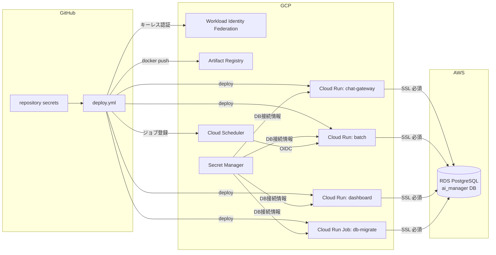

# デプロイ設定手順

- 対象: AI マネージャー Phase 1(chat-gateway / batch / dashboard / db-migrate)
- デプロイ方式: GitHub Actions(`.github/workflows/deploy.yml`)による自動デプロイ
- 設定値の管理: デプロイ設定は **GitHub repository secrets**、ランタイム秘匿情報(DB 接続情報)は **GCP Secret Manager**(要件 6.3)

## 全体像



一度セットアップすれば、以後は **main ブランチへの push だけでデプロイが完了**します
(ビルド → テスト → イメージ push → DB マイグレーション → 3 サービスのデプロイ → Scheduler 登録)。

## 前提条件

| ツール | 用途 | 備考 |
|---|---|---|
| PowerShell 7+ (`pwsh`) | セットアップスクリプトの実行 | Windows PowerShell 5.1 でも可 |
| gcloud CLI | GCP リソースの作成 | オーナー相当の権限で `gcloud auth login` 済み |
| gh CLI | repository secrets の登録 | `gh auth login` 済み |
| psql | DB ロール作成・ユーザー登録 | RDS へ接続できるネットワークから実行 |

## セットアップ手順

### Step 1: AWS RDS 側の準備

既存 RDS インスタンスに対して以下を実施する(既存業務 DB とは database レベルで分離。要件 7.1)。

1. **データベース作成**(マスターユーザーで):

   ```sql
   CREATE DATABASE ai_manager;
   ```

2. **DB ロール作成**(app_rw / dashboard_ro。要件 7.5 の DB ユーザー分離):

   ```powershell
   psql "host=<RDS_HOST> dbname=ai_manager user=<マスターユーザー> sslmode=require" `
     -v app_rw_password='<強いパスワード>' `
     -v dashboard_ro_password='<強いパスワード>' `
     -f scripts/setup/create-db-roles.sql
   ```

   権限の付与(GRANT)はマイグレーションが冪等に行うため、ロール作成のみで良い。

3. **SSL の強制**(推奨): パラメータグループで `rds.force_ssl = 1`

4. **pg_cron の有効化**(夜間 ETL 用): パラメータグループの `shared_preload_libraries` に `pg_cron` を追加し、
   `cron.database_name = ai_manager` を設定して再起動。
   ※ 有効化できない場合もマイグレーションは通知だけ出して成功する(後述のフォールバック参照)

5. **セキュリティグループ**: Step 3 で採番する GCP の固定エグレス IP からの 5432/tcp を許可

### Step 2: GCP リソースの一括作成(スクリプト)

```powershell
cd scripts/setup
./bootstrap-gcp.ps1 -ProjectId <GCPプロジェクトID> -GithubRepo tsunaguba/akebono-ai-manager
```

このスクリプトは冪等(再実行安全)で、以下を作成する:

- 必要 API の有効化(Cloud Run / Artifact Registry / Secret Manager / Vertex AI / Scheduler / Chat / Drive 等)
- Artifact Registry リポジトリ `ai-manager`
- デプロイ用 SA `ai-manager-deployer`(GitHub Actions が使用)/ ランタイム用 SA `ai-manager-runtime`(Cloud Run が使用)
- Workload Identity Federation(**サービスアカウントキーを発行しないキーレス認証**。対象リポジトリからのトークンのみ許可)
- 最小権限の IAM バインディング

完了時に、repository secrets 用の設定ファイル `deploy-config.json` が出力される。

### Step 3: クロスクラウド接続(固定エグレス IP)

Cloud Run から RDS への接続経路に固定 IP を持たせる(要件 6.3)。

```powershell
# サーバーレス VPC アクセスコネクタ(初回のみ)
gcloud compute networks vpc-access connectors create ai-manager-connector `
  --region asia-northeast1 --network default --range 10.8.0.0/28

# Cloud NAT + 静的 IP(初回のみ)
gcloud compute addresses create ai-manager-egress-ip --region asia-northeast1
gcloud compute routers create ai-manager-router --network default --region asia-northeast1
gcloud compute routers nats create ai-manager-nat `
  --router ai-manager-router --region asia-northeast1 `
  --nat-external-ip-pool ai-manager-egress-ip `
  --nat-all-subnet-ip-ranges

# 採番された IP を確認し、RDS のセキュリティグループで許可する
gcloud compute addresses describe ai-manager-egress-ip --region asia-northeast1 --format 'value(address)'
```

作成後、`deploy-config.json` の `GCP_VPC_CONNECTOR` に `ai-manager-connector` を設定する。

> 未設定の場合、Cloud Run はデフォルト経路(動的 IP)で外部接続する。検証目的で RDS を一時的に広く開ける場合のみ省略可。本番は必須。

### Step 4: ランタイム秘匿情報の登録(GCP Secret Manager)

```powershell
./register-gcp-runtime-secrets.ps1 -ProjectId <GCPプロジェクトID>
```

プロンプトに従って RDS エンドポイントと各 DB ユーザーのパスワードを入力する。登録されるシークレット:

| シークレット名 | 内容 | 使用サービス |
|---|---|---|
| `ai-manager-db-host` | RDS エンドポイント | 全サービス |
| `ai-manager-db-name` | DB 名(既定 ai_manager) | 全サービス |
| `ai-manager-db-app-user` / `-password` | app_rw | chat-gateway / batch |
| `ai-manager-db-dashboard-user` / `-password` | dashboard_ro | dashboard |
| `ai-manager-db-admin-user` / `-password` | マイグレーション用管理ユーザー | db-migrate ジョブ |

### Step 5: repository secrets の登録(スクリプト)

`deploy-config.json` の空欄項目(任意)を必要に応じて埋めた後:

```powershell
./register-github-secrets.ps1 -Repo tsunaguba/akebono-ai-manager -ConfigPath ./deploy-config.json
```

登録される repository secrets:

| Secret | 必須 | 内容 |
|---|---|---|
| `GCP_PROJECT_ID` | ✔ | GCP プロジェクト ID |
| `GCP_PROJECT_NUMBER` | ✔ | GCP プロジェクト番号(Chat リクエスト検証の audience) |
| `GCP_REGION` | ✔ | リージョン(asia-northeast1) |
| `GCP_WORKLOAD_IDENTITY_PROVIDER` | ✔ | WIF プロバイダのリソース名 |
| `GCP_DEPLOY_SERVICE_ACCOUNT` | ✔ | デプロイ用 SA のメールアドレス |
| `GCP_RUNTIME_SERVICE_ACCOUNT` | ✔ | ランタイム用 SA のメールアドレス |
| `GCP_ARTIFACT_REPOSITORY` | ✔ | Artifact Registry リポジトリ名 |
| `GCP_VPC_CONNECTOR` | — | VPC コネクタ名(固定エグレス IP 経路。本番必須) |
| `ADMIN_SPACE_ID` | — | エスカレーション通知先の Chat スペース(spaces/XXX) |
| `KNOWLEDGE_DRIVE_FOLDER_ID` | — | ナレッジ原本の Drive フォルダ ID(未設定時は同期スキップ) |
| `DASHBOARD_AUTH_MODE` | — | `iap`(既定)/ `header` / `dev` |
| `DASHBOARD_IAP_AUDIENCE` | — | IAP の expected audience(`/projects/N/global/backendServices/ID`) |

### Step 6: デプロイの実行

main ブランチへ push する(または GitHub の Actions タブ → **Deploy** → Run workflow)。

ワークフローの流れ: ビルド+テスト → イメージ push → **db-migrate ジョブ実行(マイグレーション自動適用)** →
chat-gateway / batch / dashboard のデプロイ → Cloud Scheduler ジョブ登録(すべて冪等)。

登録される Scheduler(いずれも Asia/Tokyo):

| ジョブ | スケジュール | 内容 |
|---|---|---|
| ai-manager-morning-checkin | 平日 08:00 | 朝の問いかけ配信(M2) |
| ai-manager-daily-report | 平日 18:00 | 日報生成+確認カード配信(M4) |
| ai-manager-weekly-summary | 金曜 17:00 | 管理者向け週次サマリ(M4) |
| ai-manager-knowledge-sync | 毎日 06:30 | Drive → rag スキーマ同期(M1) |

### Step 7: アプリケーション側の初期設定

1. **利用ユーザーの登録**: `scripts/setup/seed-users.sample.sql` を自社メンバーに書き換えて実行
2. **Google Chat アプリの構成**([Google Cloud Console → Chat API → 構成](https://console.cloud.google.com/apis/api/chat.googleapis.com)):
   - アプリ名・アバターを設定し、**HTTP エンドポイント URL** に chat-gateway の URL(デプロイ結果の Summary に表示)を設定
   - 「1:1 のメッセージを受信する」を有効化、公開範囲は Workspace ドメイン内に限定(要件 11)
   - 接続方法はランタイム SA を用いた「アプリ認証」を許可
3. **Drive ナレッジフォルダの共有**: ナレッジフォルダをランタイム SA(`ai-manager-runtime@<project>.iam.gserviceaccount.com`)に**閲覧者**で共有し、フォルダ ID を `KNOWLEDGE_DRIVE_FOLDER_ID` に登録
4. **ダッシュボードの IAP 構成**(本番): 外部 HTTPS ロードバランサ+サーバーレス NEG で `ai-manager-dashboard` を公開し、IAP を有効化。
   backend service の ID から audience(`/projects/<番号>/global/backendServices/<ID>`)を `DASHBOARD_IAP_AUDIENCE` に登録して再デプロイ。
   アクセスを許可する Workspace ユーザーに「IAP で保護されたウェブアプリユーザー」ロールを付与
5. **予算アラート**: GCP の予算とアラートで月額上限(50% / 80% / 100% 段階)を設定(要件 9)

## 運用

### 手動フォールバック(自動化が使えない場合)

- **マイグレーションのみ再実行**:

  ```powershell
  gcloud run jobs execute ai-manager-db-migrate --region asia-northeast1 --wait
  ```

- **pg_cron が使えない環境の ETL**: 任意のスケジューラから管理ユーザーで
  `SELECT dwh.run_daily_etl();` を毎日 02:30 JST に実行する。
  pg_cron が後から有効化された場合は db-migrate ジョブの再実行で自動登録される
  (`0004_pg_cron.sql` は登録済みチェック付きのため再実行安全)。

- **サービスの手動デプロイ**: `.github/workflows/deploy.yml` の各ステップの
  `gcloud run deploy` コマンドをそのまま端末で実行できる(環境変数を読み替えること)。

### トラブルシューティング

| 症状 | 原因と対処 |
|---|---|
| deploy.yml が「repository secrets が未設定です」で失敗 | Step 5 を実施する |
| WIF 認証エラー(`unauthorized_client`) | `GCP_WORKLOAD_IDENTITY_PROVIDER` の値、WIF の attribute-condition のリポジトリ名を確認 |
| Cloud Run から DB に接続できない | RDS の SG が NAT の固定 IP を許可しているか、`GCP_VPC_CONNECTOR` が設定されているか確認 |
| SSL 接続エラー | イメージ同梱の RDS CA バンドルを使用している(`DB_SSL_CA`)。RDS の証明書ローテーション時はイメージを再ビルド |
| Chat がゲートウェイを呼べない(401) | `GCP_PROJECT_NUMBER` が正しいか、Chat アプリの構成のエンドポイント URL を確認 |
| 朝の問いかけが届かない | 対象ユーザーの `chat_space_id` が未登録(本人が一度 Chat アプリに話しかけると自動登録される) |
| ダッシュボードが 401 | IAP 経由でアクセスしているか、`DASHBOARD_IAP_AUDIENCE` を確認 |

### エラーコード

想定エラーには `AIM-xxxx` 形式のコードが付与され、Cloud Logging に構造化ログとして出力される。
逆引きは [docs/operations/error-codes.md](./error-codes.md) を参照。
