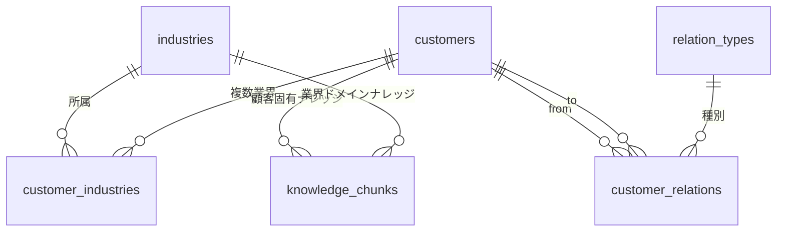

# AI マネージャー要件定義 v0.3 追補 — マスタ管理とナレッジスコープ

> **位置づけ:** 本書は `ai-manager-requirements-design.md`(v0.2)への**追補**であり、v0.2 本文は変更しない。
> v0.2 と本書が矛盾する場合は本書(v0.3)を優先する。
> **背景:** Phase 2 の「ナレッジ 6 社分への拡張」(v0.2 §10)に先立ち、オペレーターとの設計協議
> (2026-07-09)で確認された 3 つの構造的課題を要件化する。

## 1. 背景と課題

Phase 1 実装の運用開始により、以下の課題が確認された。

| # | 課題 | 現状 | 影響 |
|---|---|---|---|
| C1 | 業界がマスタではない | `ops.customers.industry` は DDL の CHECK 制約(固定 6 値) | 契約先業界が増えるたびにマイグレーションが必要。運用で追加できない |
| C2 | ナレッジ検索に顧客スコープがない | RAG 検索は doc_type のみで絞り込み。customer_id は取得するが未使用 | 顧客数が増えると、ある顧客の質問に別顧客の固有情報が混入するリスク |
| C3 | マスタ管理 UI がない | 顧客・ユーザー登録は SQL 直接実行 | 運用ミスの温床。非エンジニアが管理できない |

さらに、顧客業務の実態として**顧客間の連携関係がナレッジ参照範囲を決める**ことが判明した:

- 例 1: メーカー顧客(商品マスタ管理・生産管理・発注管理・売上管理・在庫管理を提供)は、小売・倉庫との
  連携機能を持つため、メーカー業界のドメイン情報に加えて、小売業界・対象小売固有・倉庫業界・対象倉庫固有の
  ドメイン情報を必要とする
- 例 2: アパレル小売(しまむら)には「しまむら固有+小売業+アパレル業界」、しまむらと取引のあるメーカー
  (undeux)には「undeux 固有+しまむら固有+アパレル業界」の知識が必要になる

## 2. 設計原則(本追補で確定する判断)

1. **業界は直交する軸の組み合わせで表現する。** 「アパレル小売」のような複合業界値を増やすのではなく、
   「小売」「アパレル」を別個の業界としてマスタ化し、顧客に複数付与する(多対多)。業界追加時の
   組み合わせ爆発を防ぐ。
2. **構造と意味を分離する。** 「誰と誰がどう繋がるか」(構造)は RDB で決定的に処理し、ナレッジ検索の
   スコープ導出に使う。「その関係が業務上何を意味するか」(意味)はナレッジ文書(テキスト)に書き、
   RAG 経由で AI に解釈させる。スコープ判定を LLM に任せると誤混入が再現不能な形で起きるため、
   ここは決定的 SQL とする。
3. **グラフ DB は導入しない。** 必要なのは 1〜2 ホップの到達可能集合であり、顧客数十・関係エッジ数百の
   スケールでは PostgreSQL の再帰 CTE / JOIN で完結する。新しいデータストアの追加は SoT の分裂と
   同期バグを招く(CLAUDE.md 開発原則 6)。再検討条件: 3 ホップ以上の探索・パス自体が問いになる
   ユースケース・エッジ数が数十万を超えた時点。
4. **ベクトル検索は「構造で絞り、意味で並べる」。** スコープ導出結果を pgvector 検索の前置フィルタ
   (WHERE 句)として適用する。GraphRAG 等のグラフ×LLM 統合手法は現段階では採用しない。

## 3. データモデル要件

### 3.1 業界マスタ(C1 対応)

```sql
CREATE TABLE ops.industries (
  industry_id   TEXT PRIMARY KEY,          -- 例: 'retail', 'apparel', 'warehouse'
  name          TEXT NOT NULL,             -- 表示名(例: '小売業')
  active        BOOLEAN NOT NULL DEFAULT true,
  display_order INT,
  created_at    TIMESTAMPTZ NOT NULL DEFAULT now(),
  updated_at    TIMESTAMPTZ NOT NULL DEFAULT now()
);
```

- `ops.customers.industry` の CHECK 制約は**廃止**する
- 既存 6 値(apparel_retail / apparel_maker / zakka / bedding / logistics / other)は移行パッチで
  マスタ行へ変換する。複合値(apparel_retail 等)は直交軸(apparel + retail)への分解を移行時に行い、
  変換対応表を移行パッチに明記する

### 3.2 顧客×業界(多対多)

```sql
CREATE TABLE ops.customer_industries (
  customer_id TEXT NOT NULL REFERENCES ops.customers(customer_id),
  industry_id TEXT NOT NULL REFERENCES ops.industries(industry_id),
  is_primary  BOOLEAN NOT NULL DEFAULT false,  -- dwh の分析軸(dim_customer.industry)用の主業界
  PRIMARY KEY (customer_id, industry_id)
);
```

- 主業界(is_primary)は顧客ごとに 1 件のみ(部分ユニークインデックスで担保)
- dwh.dim_customer.industry(SCD Type 2)は主業界を追従する(分析軸の下位互換を維持)

### 3.3 顧客間関係(有向エッジ)

```sql
CREATE TABLE ops.relation_types (
  relation_type TEXT PRIMARY KEY,   -- 例: 'supplies_to', 'fulfills_for', 'sells_via'
  label         TEXT NOT NULL,      -- 表示名(例: '納品先')
  active        BOOLEAN NOT NULL DEFAULT true
);

CREATE TABLE ops.customer_relations (
  from_customer_id TEXT NOT NULL REFERENCES ops.customers(customer_id),
  to_customer_id   TEXT NOT NULL REFERENCES ops.customers(customer_id),
  relation_type    TEXT NOT NULL REFERENCES ops.relation_types(relation_type),
  notes            TEXT,
  created_at       TIMESTAMPTZ NOT NULL DEFAULT now(),
  PRIMARY KEY (from_customer_id, to_customer_id, relation_type),
  CHECK (from_customer_id <> to_customer_id)
);
```

- 向きの意味は relation_type が定義する(例: undeux --supplies_to--> しまむら)
- 関係の業務的な意味・運用ルールはナレッジ文書側に記述する(設計原則 2)

### 3.4 ナレッジチャンクへの業界帰属追加(C2 対応)

- `rag.knowledge_chunks` に `industry_id TEXT`(NULL 可)を追加する
- Drive フォルダ規約の `domain/{業界}/` の {業界} セグメントを `ops.industries.industry_id` と突合する。
  マスタに存在しない場合は **industry_id = NULL で取り込み、警告ログ(AIM コード付与)を出す**
  (取り込みを止めない: 開発原則 4)
- `customer/{顧客ID}/` の {顧客ID} も同様に `ops.customers` と突合し、不一致は警告ログ+取り込み継続

### 3.5 ER 図



## 4. ナレッジスコープ導出要件(C2 対応)

### 4.1 スコープ定義

質問の文脈から**対象顧客**が特定できた場合、検索対象は以下の和集合とする:

1. 対象顧客の固有ナレッジ(customer_id 一致)
2. 対象顧客が所属する全業界のドメインナレッジ(industry_id ∈ 所属業界)
3. 関係先顧客(1 ホップ、向き不問)の固有ナレッジ
4. 関係先顧客が所属する業界のドメインナレッジ
5. 顧客・業界に紐づかない共通ナレッジ(judgement 系・例え話・industry_id と customer_id が共に NULL)

- ホップ数の既定は 1。環境変数で 2 まで拡張可能とする(それ以上は要件外)
- 導出は再帰 CTE または JOIN による**決定的 SQL** で行う(設計原則 2)

### 4.2 対象顧客が特定できない場合

顧客固有ナレッジ(customer_id が非 NULL のチャンク)を**除外**し、業界・共通ナレッジのみを検索する。

> **判断理由:** 誤った顧客の固有情報を回答に混入させるリスクは、検索ヒットが減るデメリットより重い
> (信頼毀損は回復困難)。ただし運用データで過剰な絞り込みと判明した場合に備え、
> 「特定不能時は全域検索(v0.2 までの挙動)」へ切り替えるフラグを残す。

### 4.3 対象顧客の特定方法(優先順)

1. 対話文脈(進行中タスク・日報対話)に紐づくプロジェクトの顧客
2. 質問文中の顧客名・顧客 ID のマスタ照合(表記ゆれはマスタに別名列を追加して対応してもよい)
3. 特定できなければ §4.2 の既定動作

## 5. マスタ管理 UI 要件(C3 対応)

ダッシュボードに**管理者限定**のマスタ管理ページを追加する。

| 対象 | 操作 | 備考 |
|---|---|---|
| 業界マスタ | 一覧・追加・編集・無効化 | 物理削除はしない(参照整合性) |
| 顧客マスタ | 一覧・追加・編集・無効化+所属業界(複数)の設定 | 主業界の指定を含む |
| 顧客間関係 | 一覧・追加・削除 | 関係種別はマスタから選択 |
| 関係種別マスタ | 一覧・追加・編集・無効化 | |

- ユーザーマスタ(ops.users)の UI 管理は本追補のスコープ外(SQL 運用を継続。将来検討)
- モバイル対応は CLAUDE.md 開発原則 8 に従う

### 5.1 権限設計(重要)

- **専用の書込ロール `ai_manager_admin_rw` を新設**し、マスタ 4 表(industries / customer_industries /
  customer_relations / relation_types)と ops.customers のみ INSERT / UPDATE を許可する
- 既存の閲覧ロール(ai_manager_dashboard_ro)の権限は**広げない**。管理ページのリクエストのみ
  管理用接続プールを使用する二重制御(アプリ層 role=admin 判定+DB ロール分離)
- 変更操作はすべて監査ログ(誰が・いつ・何を)を Cloud Logging に残す
- POST フォームには CSRF トークンを必須とする

## 6. 移行・下位互換要件(CLAUDE.md 開発原則 7)

1. versioned マイグレーションとして提供する(0004 以降)。適用順:
   マスタ表作成 → 既存 industry 値からマスタ行と customer_industries を生成 → CHECK 制約撤廃
2. 既存 `ops.customers.industry` カラムは移行完了後も**当面残す**(dwh ETL・既存ビューの互換)。
   ETL とビューが customer_industries 参照へ切り替わった後のバージョンで削除する(二段階移行)
3. rag.knowledge_chunks への列追加は NULL 許容で行い、既存チャンクは次回 knowledge-sync の
   全件再分類で industry_id が付与される(content_hash が同一でも分類のみ更新する経路を用意)
4. 移行パッチには変換対応表(旧 enum 値 → 新業界の組)とロールバック不能点を明記し、
   オペレーターへ適用手順を説明する

## 7. スコープ外(本追補では実施しない)

- グラフ DB / GraphRAG の導入(§2 の再検討条件を満たすまで)
- Google カレンダー連携(Agent Engine とともに Phase 2 の M3/M6 実装時に判断。ADR-3 参照)
- ユーザーマスタの UI 管理
- ナレッジ文書自体の Chat からの投入(v0.2 どおり Phase 2)

## 8. 受け入れ基準

1. 業界の追加・顧客への複数業界付与・顧客間関係の登録が、SQL を書かずにダッシュボードから行える
2. 関係を登録した顧客の質問で、関係先顧客の固有ナレッジと関係先業界のドメインナレッジが検索対象に入る
   (例 2 の undeux / しまむらのシナリオを統合テストとして再現する)
3. 対象顧客が特定できない質問で、他顧客の固有ナレッジが回答に混入しない
4. 既存の Phase 1 データ(顧客・ナレッジ・対話ログ)が移行後も欠損なく参照できる
5. 閲覧専用ロールでマスタ表の変更ができないことをテストで確認する

## 9. Phase 計画との関係

本追補は v0.2 §10 の Phase 2(ナレッジ 6 社分へ拡張)の**前提整備**にあたる。
実装順の推奨: 本追補(マスタ+スコープ)→ ナレッジ 6 社投入 → M3 / M6(Phase 2 本体)。

---

*v0.3 追補(2026-07-09)— オペレーター協議に基づく。基底文書: ai-manager-requirements-design.md(v0.2)*
